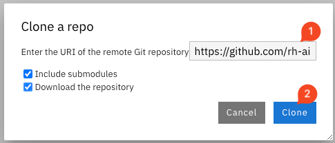

= Creating your playpen project

As a preliminary step, each of you is going to
1. Create a project
2. Create a Data Connection
3. Launch a Workbench
4. Git-Clone the common repo

== Create a project

== Create a Data Connection

== Launch a Workbench
image::02/launch-workbench-01.png[]

== Git-Clone the common repo

[tabs]
====
Using the Git UI::
+
--
If you want to use the UI:
image::2023-12-11-12-07-52.png[]

--
Using the Git CLI::
+
--
[.console-input]
[source,adoc]
----
git clone https://github.com/rh-aiservices-bu/insurance-claim-processing.git
cd insurance-claim-processing/
git checkout dev
----
--
====

